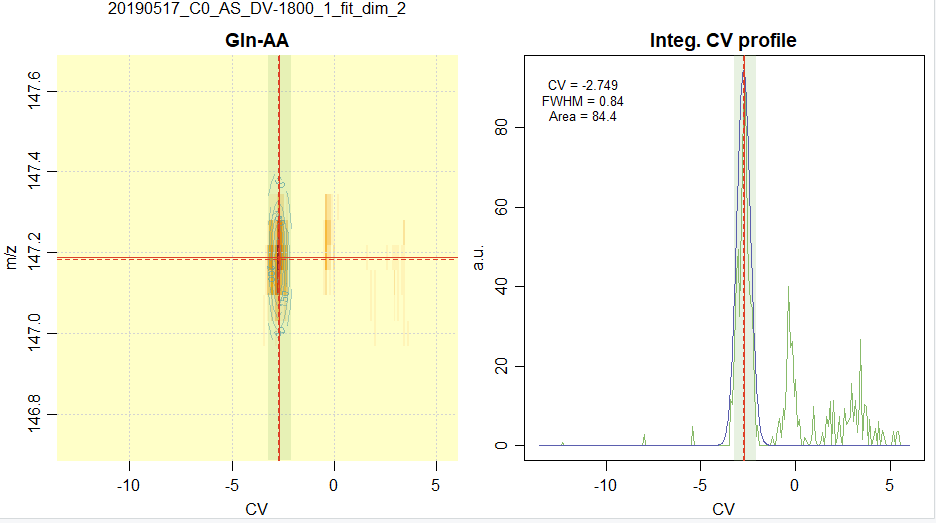
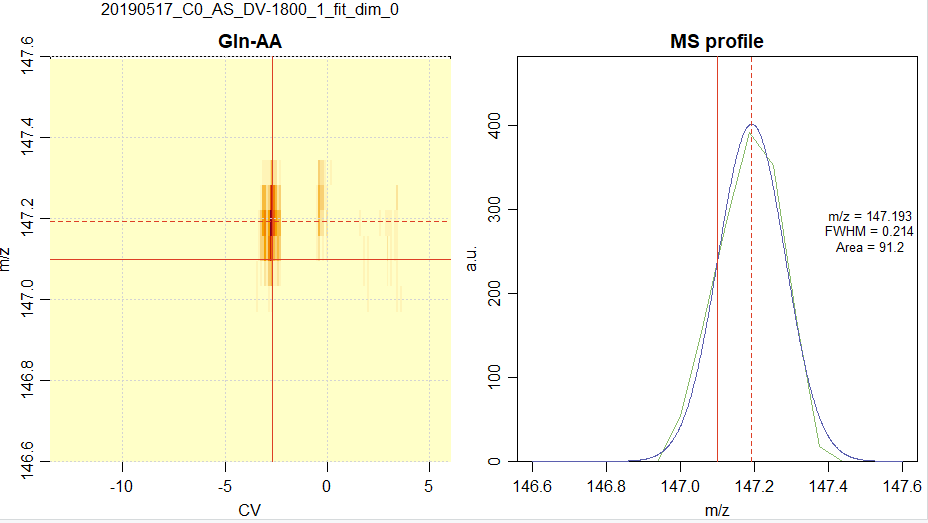

MS-Ana
================

  - [Purpose](#purpose)
  - [Organisation](#organisation)
  - [Input files](#input-files)
      - [`taskTable`](#tasktable)
      - [`tgTable`](#tgtable)
      - [`quantTable`](#quanttable)
  - [Scripts](#scripts)
      - [`analysis.R`](#analysis.r)
      - [`checkRep.R`](#checkrep.r)
      - [`quantify.R`](#quantify.r)

# Purpose

# Organisation

The project is organized into the following folders:

    |- analysis :   contains the R scripts 
    |               (analysis.R, checkRep.R, quantify.R)
    |               and their auxillary functions
    |
    |- data :       default folder for the input tables and 
    |               data to be analyzed
    |
    |- results :    where the outputs of the scripts are stored
    |  |
       |- figs :    figures
       |
       |- tables :  tables

The scripts should be run from the `analysis` folder, and the paths to
the required folders are defined in the scripts as:

    # Define Data and Results repositories
    dataRepo = '../data/'
    figRepo  = '../results/figs/'
    tabRepo  = '../results/tables/'

The MS and DMS files are expected by default to be in `data`. For
complex projects, they can be placed in sub-folders of `data`, and their
paths are given in the input files.

# Input files

Three input files (named `taskTable`, `tgTable` and `quantTable`) are
used by the set of scripts :

| Script \\ Input | `taskTable` | `tgTable` | `quantTable` |
| --------------- | ----------- | --------- | ------------ |
| `analysis.R`    | X           | X         |              |
| `checkRep.R`    | X           |           | X            |
| `quantify.R`    | X           |           | X            |

## `taskTable`

This file defines the list of MS/DMS files to be analyzed.

It is a “comma” (,) delimited text file. It can be edited using excel or
Rstudio (safer).

`taskTable` is structured like this:

| MS\_file                   | DMS\_file                         | t0   | CV0 | dilu | Path                                            |
| -------------------------- | --------------------------------- | ---- | --- | ---- | ----------------------------------------------- |
| C0\_AS\_DV-1800\_1.d.ascii | Fichier\_Dims 20190517-000000.txt | 0.08 | 6   | 0    | Esquire\_MSMS\_Data/2019\_A\_Voir/20190517\_AA/ |

Where:

  - `C0_AS_DV-1800_1.d.ascii` is an ASCII file, extracted using
    DATAANALYSIS. So far, only the ESQUIRE data files extracted using
    the `profile` option can be handled. It is stored in a sub-folder of
    `data` defined by `Path`.

  - `Fichier_Dims 20190517-000000.txt` is the corresponding DMS file. It
    is expected to be in the `data` folder.

  - `t0` and `CV0` are used to convert the ESQUIRE time *t* values into
    DMS *CV* values.

  - `dilu` was initially meant to be the dilution factor of the standard
    metabolites when spiked into a plasma (see checkRep). When you
    perform another type of experiment, you can use  
    `dilu` as an index to specify, for example, the flow-rate of the
    modifier, the day of the experiment, the set of samples…

  - `Path` allows you to organize your data within the `../data/`
    folder. Note that the DMS\_files must be in the `../data` folder. In
    the present example, only the MS\_files are expected to be found in
    the following folder:
    `../data/Esquire_MSMS_Data/2019_A_Voir/20190517_AA/`.

**Notes**

  - lines starting with “\# “ will be considered as comment lines

  - the date from the DMS\_file (here *20190517*)  
    and the root of the MS file name (here `C0_AS_DV-1800_1`) are
    combined to tag the output files (*e.g.*, `20190517_
    C0_AS_DV-1800_1.results`) This *tag* in also used for the output
    figures.

## `tgTable`

This file contains the list of compounds to be analyzed in each MS/DMS
data set.

It is a “semicolon” (;) \_\_ TO BE MATCHED WITH TASKTABLE \!\!\!\_\_
delimited text file. It can be edited using excel or Rstudio (safer).

`tgTable` is structued like this:

| Name      | m/z\_EExact | m/z\_exact | CV\_ref |
| --------- | ----------- | ---------- | ------- |
| \# Gly-AA | C2H5NO2H    | 76         | \-10.7  |
| Ala-AA    | 90.054955   | 90.1       | \-7.6   |

Where:

  - `Name` is the given name of a metabolite,

  - `m/z_EExact` is presently not used

  - `m/z_exact` can actually be an approximate *m/z* value

  - `CV_ref` is the expected *CV* value (can be omitted)

**Notes**

  - lines starting with “\# “ will be considered as comment lines. In
    the present example, Glycine will not be analyzed.

## `quantTable`

TBD

# Scripts

## `analysis.R`

(last version from 2020, July 16)

For each DMS-MS/MS experiment as given in a series in the `taskTable`
file, the series of metabolites given in `tgTable` is analyzed. The aim
of the analysis is to integrate the peak (*i.e.*, to estimate the area)
corresponding to each metabolite.

In the present version, a Gaussian peak shape is used. The formula of a
Gaussian function is   
=\\frac{a}{\\sqrt{2\\pi}\\sigma} 
  \\exp\\left(-\\frac{1}{2}\\left(\\frac{x-x_0}{\\sigma}\\right)^2\\right)
")  
where  is the area,
 is the position
of the peak, and
 is
related to the full width at maximum
() by } \\sigma"). Upon the fit process of the data,
the area () is
optimized, as well as the peak’s position and width
( and
).

From the two dimensional data (*m/z*, *CV*), the area can be extracted
using a 2D fit where the fit function is the product of two Gaussian
functions, one in the *m/z*, the other in the *CV* dimension.

It turns out that we need three types of fit:

  - 2D fit in the (*m/z*, *CV*) space

  - 1D fit in the (*CV*) space, assuming that the *m/z* value is
    `m/z_exact` as given in `tgTable` **(not exactly: the nearest peak
    position is used)**

  - 1D fit in the *m/z* space, assuming that the *CV* value is the
    `CV_ref` given in the `tgTable`

### Controle variables

The choice of fit type is set using the `fit_dim` variable. More
generally, the important user configuration parameters are listed within
the first line of the `analysis.R` script as follows:

    # User configuration params ####
    taskTable = 'files_quantification_2019.csv'
    tgTable   = 'targets_paper.csv'
    
    save_figures = TRUE
    plot_maps    = FALSE
    
    # Fit controling parameters
    fit_dim  = 0    # in (0, 1, 2)
    fallback = TRUE # Fallback on fit_dim=1 if 2D fit fails
    
    weighted_fit  = FALSE
    const_fwhm    = ifelse(fit_dim == 0,NA,0.7)
    
    refine_CV0 = TRUE
    dmz = 1.0       # Width of mz window around
                    # exact mz for signal averaging
    dCV = 1.2       # Width of CV window around
                    # reference CV for peak fit
    
    filter_results = TRUE
    fwhm_mz_min = 0.1
    fwhm_mz_max = 0.5
    fwhm_cv_min = 0.5
    fwhm_cv_max = 1.5
    area_min    = 10

  - `taskTable`: (string) file path to the tasks table

  - `tgTable`: (string) file path to the targets table

  - `save_figures`: (logical) save the plots on disk

  - `plot_maps`: (logical) generate 2D maps summarizing the position of
    fitted targets for a given task

  - `fit_dim`: (interger) fit dimension and type:
    
      - `fit_dim = 2`: a two\_dimensional (*m/z*,*CV*) fit is performed
    
      - `fit_dim = 1`: a 1D fit in the *CV* dimension is performed.  
    
      - `fit_dim = 0`: a 1D fit, but in the *m/z* dimension at fixed
        `CV_ref` (initially named “fast”).

  - `fallback`: (logical) use `fit_dim=1` in cases where `fit_dim=2`
    fails (optimizer does not converge).

  - `weighted_fit`: (logical) apply a Poisson-type weighting to the
    fitted data

  - `const_fwhm`: (numerical) value of the peak’s fwhm in the *CV*
    dimension (`fit_dim=1,2`) of the *m/z* dimention (`fit_dim=0`). If
    `const_fwhm=NA`, the value is optimized, otherwise, it is fixed to
    the specified value.

  - `refine_CV0`: (logical) refine the center of the search window for
    the *CV* position of the peak. If `FALSE`, use the value defined in
    `tgTable`.

  - `dmz`, `dCV`: (numericals) width of search intervals for the peak’s
    position. These intervals are centered on (possibly refined) values
    of `m/z_exact` and `CV_ref` given in `tgTable`.

  - `filter_results`: (logical) filter the recovered peak widths and
    areas. The filtering rejects fwhm values outside of
    
      - \[`fwhm_mz_min`,`fwhm_mz_max`\] in the *m/z* dimension
    
      - \[`fwhm_cv_min`,`fwhm_cv_max`\] in the *CV* dimension
    
    and areas smaller than `area_min`.

### Outputs

The output files can be found in the following repositories:

    figRepo  = '../results/figs/'
    tabRepo  = '../results/tables/'

#### Figures

For each task and target, you get a figure (on the screen and as a file)
as shown below.

For a 2D fit: 

For a 1D fit along m/z, i.e., `fit_dim=0`: 

#### Tables

For each experiments/task associated with (MS\_file, DMS\_file), three
‘.csv’ files are generated.

If your data are (MS\_file= C0\_AS\_DV-1800\_1.d.ascii, DMS\_file=
Fichier\_Dims 20190517-000000.txt), and if `fit_dim=2`, you get:

  - a results file named
    `20190517_C0_AS_DV-1800_1_fit_dim_2_results.csv` with the following
    columns:
    
      - the first 4 columns are copies of the `tgTable` data:
        
        | Name | m/z\_EExact | m/z\_exact | CV\_ref |
        | ---- | ----------- | ---------- | ------- |

      - the next 8 columns correspond to the position, width and
        uncertainty values of the optimized Gaussian in the m/z and CV
        dimensions (unavailable data are represented by `NA`)
        
        | m/z | u\_m/z | CV | u\_CV | FWHM\_m/z | u\_FWHM\_m/z | FWHM\_CV | u\_FWHM\_CV |
        | --- | ------ | -- | ----- | --------- | ------------ | -------- | ----------- |

      - the next 2 columns are the results for the optimized Area
        values, and corresponding uncertainty.
        
        | Area | u\_Area |
        | ---- | ------- |

      - finally, you will find the `fit_dim` value, the `dilu` index,
        and the `tag` which is a concatenation of date + MS\_filename +
        fit\_dim that can be used for further sorting of the results.
        
        | fit\_dim | dilu | tag |
        | -------- | ---- | --- |

## `checkRep.R`

This script collects the set of results files generated by `analysis.R`
as specified in the `taskTable` and generates figures and statistics.
The peak parameters are plotted as a function of `dilu`. If `dilu`
contains the experiment index, `checkRep.R` can be used to assess the
repeatability of an analysis.

### Controle variables

The job is defined by a few parameters.

    taskTable  = 'files_quantification_2019July10.csv'
    quantTable = 'targets_paper_quantification.csv'
    
    fit_dim = 2
    userTag = paste0('fit_dim_',fit_dim)
    
    const_fwhm = 0.7
    
    makePlots = TRUE

  - `taskTable`: (string) file path to the list of experiments to be
    compared

  - `quantTable`: (string) list of the compounds for which the
    comparisons should be done

  - `fit_dim`: (integer) type of peak fit for which the comparisons
    should be done

  - `userTag`: (string) tag to differentiate the outputs. In the present
    case, one wants to compare the repeatability for different peak fit
    approaches.

  - `const_fwhm`: (numerical) estimate of the peak width in the *CV*
    direction to define the plot axes.

  - `makePlots`: (logical) generate the plots

### Outputs

#### Figs

Presently, the plots are generated in the Rstudio interface, but no
saved to disk.

#### Tables

A “.csv” table containing all the collected results, with the following
additions:

  - two columns containing the ratio of areas for pairs of compounds
    defined in `quantTable`, and its uncertainty
    
    | ratio | u\_ratio |
    | ----- | -------- |

  - a set of lines with tag “Mean”, containing for each target compound,
    the mean of the properties over the set of experiments. Weighted
    means are estimated, based on the inverse of the squared
    uncertainties.

The name of the file is a concatenation of the date, time, `userTag`,
and ’\_compilation.csv’

## `quantify.R`

This script is based on the same principle as `checkRep.R` (same input
files), but aims to estimate the quantification parameters, such as the
LOD.

### Controle variables

The job is defined by a few parameters.

    taskTable  = 'files_quantification_2019July10.csv'
    quantTable = 'targets_paper_quantification.csv'
    
    fit_dim = 2
    userTag = paste0('fit_dim_',fit_dim)

  - `taskTable`: (string) file path to the list of experiments to be
    compared

  - `quantTable`: (string) list of the compounds for which the
    comparisons should be done

  - `fit_dim`: (integer) type of peak fit for which the comparisons
    should be done

  - `userTag`: (string) tag to differentiate the outputs. In the present
    case, one wants to compare the repeatability for different peak fit
    approaches.

### Outputs

#### Figs

A PDF file is generated, containing the quantification plots for all
compounds.

The name of the file is a concatenation of the date, time, `userTag`,
and ’\_quantif.pdf’

#### Tables

A “.csv” table containing the quantification results, with columns

| Name | Int | Slo | Slo0 | LOD |
| ---- | --- | --- | ---- | --- |

where

  - ‘Name’ is the name of the compound

  - ‘Int’ is the value of the intercept

  - ‘Slo’ is the value of the slope

  - ‘Slo0’ is the value of the slope with null intercept

  - ‘LOD’ is the estimated limit of detection

The name of the file is a concatenation of the date, time, `userTag`,
and ’\_quantif.csv’
