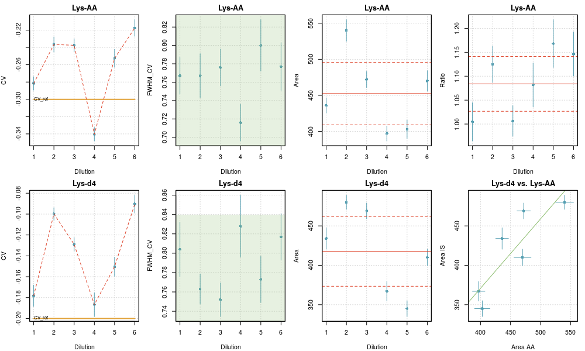
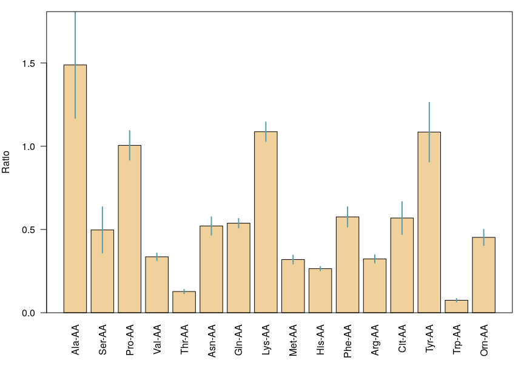

MS-Ana
================
Philippe MAITRE and Pascal PERNOT
2021-04-08

-   [Purpose](#purpose)
-   [Project structure](#project-structure)
-   [Workflow](#workflow)
    -   [0- Pretreatment](#pretreatment)
    -   [1- Analysis](#analysis)
    -   [2- Quantification](#quantification)
-   [Input files](#input-files)
    -   [`taskTable`](#tasktable)
        -   [Structure](#structure)
    -   [`tgTable`](#tgtable)
        -   [Structure](#structure-1)
    -   [`quantTable`](#quanttable)
        -   [Structure](#structure-2)
-   [Scripts](#scripts)
    -   [`pretreatFTICR.R`](#pretreatfticr.r)
    -   [`analysis.R`](#analysis.r)
        -   [Peak model](#peak-model)
        -   [Fit algorithm](#fit-algorithm)
        -   [Control variables](#control-variables)
        -   [Outputs](#outputs)
    -   [`checkRep.R`](#checkrep.r)
        -   [Control variables](#control-variables-1)
        -   [Outputs](#outputs-1)
    -   [`quantify.R`](#quantify.r)
        -   [Control variables](#control-variables-2)
        -   [Outputs](#outputs-2)
-   [References](#references)

# Purpose

Analysis and quantification for DMS spectra.

# Project structure

The project is organized into the following folders structure:

    ├── analysis :   contains the R scripts 
    │               (analysis.R, checkRep.R, quantify.R)
    │               and their auxillary functions
    │
    ├── data :       default folder for the input tables and 
    │               data to be analyzed
    │
    ├── results :    where the outputs of the scripts are stored
    │   │
        ├── figs :    figures
        │
        └── tables :  tables

The scripts should be run from the `analysis` folder, and the paths to
the required folders are defined in the scripts as:

    # Define Data and Results repositories
    dataRepo = '../data/'
    figRepo  = '../results/figs/'
    tabRepo  = '../results/tables/'

The MS and DMS files are expected by default to be in `data`. For
complex projects, the MS files can be placed in sub-folders of `data`,
and their paths are given in the `taskTable` input file.

# Workflow

## 0- Pretreatment

1.  FT-ICR MS files should be compressed using `pretreatFTICR.R` to
    enable analysis

## 1- Analysis

1.  put MS files in `data` folder or a sub-folder

2.  put DMS files in `data`

3.  create `taskTable` and `tgTable` input files in `data` folder

4.  edit and run `analysis.R`

    -   enter the file paths to the `taskTable` and `tgTable` files  
    -   choose the type of peak fit (variable `fit_dim`)

## 2- Quantification

1.  create `quantTable` in `data` folder

2.  edit and run `checkRep.R` and/or `quantify.R`

    -   enter the file paths to the `taskTable` and `quantTable` files  
    -   choose the type of peak fit (variable `fit_dim`) used in the
        analysis step

# Input files

Three input files (formally named `taskTable`, `tgTable` and
`quantTable`) are used by the set of scripts :

| Script \\ Input | `taskTable` | `tgTable` | `quantTable` |
|-----------------|-------------|-----------|--------------|
| `analysis.R`    | X           | X         |              |
| `checkRep.R`    | X           |           | X            |
| `quantify.R`    | X           |           | X            |

## `taskTable`

This file defines the list of MS-DMS pairs to be analyzed.

It is a “comma” (,) delimited ‘.csv’ file. It can be edited using excel
or Rstudio (safer).

### Structure

| MS\_file                   | DMS\_file                         | t0   | CV0 | dilu | Path                                            |
|----------------------------|-----------------------------------|------|-----|------|-------------------------------------------------|
| C0\_AS\_DV-1800\_1.d.ascii | Fichier\_Dims 20190517-000000.txt | 0.08 | 6   | 0    | Esquire\_MSMS\_Data/2019\_A\_Voir/20190517\_AA/ |

Where:

-   `MS_file` is an ASCII file, extracted using DATAANALYSIS. So far,
    only the ESQUIRE data files extracted using the `profile` option can
    be handled. It is stored in `data` or a sub-folder of `data` defined
    by `Path`.

-   `DMS_file` is the corresponding DMS file. It is expected to be in
    the `data` folder.

-   `t0` and `CV0` are used to convert the ESQUIRE time *t* values into
    DMS *CV* values.

-   `dilu` was initially meant to be the dilution factor of the standard
    metabolites when spiked into a plasma (see checkRep). When you
    perform another type of experiment, you can use  
    `dilu` as an index to specify, for example, the flow-rate of the
    modifier, the day of the experiment, the set of samples…

-   `Path` allows you to organize your data within the `../data/`
    folder. Note that the DMS\_files must be in the `../data` folder. In
    the present example, only the MS file is expected to be found in the
    following folder:
    `../data/Esquire_MSMS_Data/2019_A_Voir/20190517_AA/`.

**Notes**

-   lines starting with “\#” are not processed and treated as comments
    lines

-   the date extracted from `DMS_file` (here ‘20190517’)  
    and the root of the `MS_file` name (here ‘C0\_AS\_DV-1800\_1’) are
    combined to tag the output figures and tables (*e.g.*, ‘20190517\_
    C0\_AS\_DV-1800\_1.results’)

## `tgTable`

This file contains the list of compounds to be analyzed in each MS/DMS
data set.

It is a “commma” (,) delimited ‘.csv’ file. It can be edited using excel
or Rstudio (safer).

### Structure

| Name      | Comments  | m/z\_ref | CV\_ref |
|-----------|-----------|----------|---------|
| \# Gly-AA | C2H5NO2H  | 76       | -10.7   |
| Ala-AA    | 90.054955 | 90.1     | -7.6    |

where:

-   `Name` is the given name of a metabolite,

-   `Comments` is presently not used

-   `m/z_ref` is the expected (approximate) *m/z* value

-   `CV_ref` is the expected *CV* value (it can be omitted)

**Notes**

-   lines starting with “\#” will be considered as comment lines. In the
    present example, Glycine will not be analyzed.

## `quantTable`

This file contains the list of compounds and internal references used
for quantification.

It is a “comma” (,) delimited ‘.csv’ file. It can be edited using excel
or Rstudio (safer).

### Structure

| Name      | IS       | CAA\_Plasma | CAA\_ref | CIS\_ref |
|-----------|----------|-------------|----------|----------|
| \# Gly-AA | Gly-13C2 | 11.75       | 1750     | 26.7     |
| Ala-AA    | Ala-13C2 | 16.15       | 1750     | 20       |

where

-   `Name` is the name of the compound, as used in `tgTable`

-   `IS` is the name of the internal spiking compound. It should also be
    present in `tgTable`

-   `CAA_Plasma` **???**

-   `CAA_ref` **???**

-   `CIS_ref` **???**

# Scripts

## `pretreatFTICR.R`

Raw FT-ICR DMS files are very large and are painful to analyse directly.
Two reduction methods can be used and combined:

1.  filtering the data to match as well as possible a predefined regular
    grid

2.  keeping only the data that match a list of targets

Combining both methods might enable to reduce the MS size by nearly 90%,
in the usual applications.

The script is controlled by the following parameters:

    #====================================================
    # User configuration params =========================
    #====================================================

    ## Data and results directories
    origMsDir = 'Test_FTICR_2/FTICR'
    compMsDir = 'Test_FTICR_2/FTICR_compressed'
    ms_type   = 'fticr'

    ## Compress mode
    compMode  = c('grid','targets','grid+targets')[3]

    ## Grid specifications
    mzMin     = 70
    mzMax     = 250
    dmz       = 0.001

    ## Targets specifications
    tgTable   = 'Test_FTICR_2/targets_list.csv'
    dmzTarget = 0.5 # Delta m/z to keep around target

    ## Short run to check ?
    test      = FALSE

where

-   `origMsDir`: (string) is the path to a directory containing the
    files to treat (all files within the directory will be treated).

-   `compMsDir`: (string) is the path to a directory where the
    compressed files will be stored.

-   `ms_type`: (string) is the type of MS to treat. Only `fticr` at the
    moment.

-   `compMode`: (string) compression modality, which can be `grid`,
    `targets` or their combination `grid+targets`.

-   `mzMin`, `mzMax` and `dmz`: (numbers) define the regular grid used
    for grid selection.

-   `tgTable`: (string) is the path to the targets file used for targets
    selection.

-   `dmzTarget`: (number) is the half-width of the m/z interval to keep
    around a target. The interval is centered on `ms_ref` vales in
    `tgTable`. The width should be large enough to not miss the peaks,
    but small enough for efficient compression…

-   `test`: (logical) test run only, to check if data are OK.

**Note**: it is best to store the spectra as compressed .gz files. The
disp space is well reduced and all scripts can handle them
transparently.

## `analysis.R`

For each DMS-MS/MS experiment as given in a series in the `taskTable`
file, the series of metabolites given in `tgTable` is analyzed. The aim
of the analysis is to integrate the peak (*i.e.*, to estimate the area)
corresponding to each metabolite.

### Peak model

In the present version, a Gaussian peak shape is used. The formula of a
Gaussian function is \[
G(x;a,x\_0,\\sigma)=\\frac{a}{\\sqrt{2\\pi}\\sigma}
\\exp\\left(-\\frac{1}{2}\\left(\\frac{x-x\_0}{\\sigma}\\right)^2\\right)\]
where  is the area,
 is the position
of the peak, and

is related to the full width at maximum
() by
} \\sigma").
Upon the fit process of the data, the area
() is optimized, as well
as the peak’s position and width
( and
).

From the two dimensional data (*m/z*, *CV*), the area can be extracted
using a 2D fit where the fit function is the product of two Gaussian
functions, one in the *m/z*, the other in the *CV* dimension.

It turns out that we need three types of fit:

-   2D fit in the (*m/z*, *CV*) space

-   1D fit in the (*CV*) space, assuming that the *m/z* value is near
    the `m/z_ref` as given in `tgTable`

-   1D fit in the *m/z* space, assuming that the *CV* value is the
    `CV_ref` given in the `tgTable`

### Fit algorithm

We use a non-linear (weighted) least-squares algorithm to estimate the
parameters of the model: the `nls` function of the `stats` package [1].

The parameters are constrained to intervals defined by control variables
defined below. For the 2D fits, we implemented a ‘fallback’ strategy to
1D fit in the *CV* space, in cases where the 2D optimization does not
converge. The effective dimension of the fit is reported in the results
tables.

### Control variables

The choice of fit type is set using the `fit_dim` variable. The
important user configuration parameters are listed within the first line
of the `analysis.R` script as follows:

    #----------------------------------------------------------
    # User configuration params -------------------------------
    #----------------------------------------------------------

    ms_type   = c('esquire','fticr')[2]

    taskTable = 'Test2/files_quantification_2018AA.csv'
    tgTable   = 'Test2/targets_paper_renew.csv'

    fit_dim  = 1    

    filter_results = TRUE
    area_min       = 10

    userTag = paste0('fit_dim_',fit_dim)

    save_figures = TRUE
    plot_maps    = FALSE

where:

-   `ms_type`: (string) MS type (‘esquire’ or ‘fticr’)

-   `taskTable`: (string) file path to the tasks table

-   `tgTable`: (string) file path to the targets table

-   `fit_dim`: (integer) fit dimension and type:

    -   `fit_dim = 2`: a two\_dimensional (*m/z*,*CV*) fit is performed

    -   `fit_dim = 1`: a 1D fit in the *CV* dimension is performed.

    -   `fit_dim = 0`: a 1D fit, but in the *m/z* dimension at fixed
        `CV_ref` (initially named “fast”).

-   `filter_results`: (logical) filter the recovered peak widths and
    areas. The filtering rejects fwhm values outside of

    -   \[`fwhm_mz_min`,`fwhm_mz_max`\] in the *m/z* dimension

    -   \[`fwhm_cv_min`,`fwhm_cv_max`\] in the *CV* dimension

    and areas smaller than `area_min`. The `fwhm_xxx` parameters depend
    on `ms_type` and they are defined in the `getPeakSpecs()` function.

-   `userTag`: (string) a tag that will be added to the names of the
    results files. Default uses fit-dim.

-   `save_figures`: (logical) save the plots on disk

-   `plot_maps`: (logical) generate 2D maps summarizing the position of
    fitted targets for a given task

A set of technical parameters, affecting various aspects of the peaks
fit are also available. However, their default values should not be
changed without caution.

    #----------------------------------------------------------
    # Technical params (change only if you know why...) -------
    #----------------------------------------------------------

    fallback        = TRUE   
    correct_overlap = FALSE  
    weighted_fit    = FALSE
    refine_CV0      = TRUE
    debug           = FALSE  

-   `fallback`: (logical) use `fit_dim=1` in cases where `fit_dim=2`
    fails (optimizer does not converge).

-   `correct_overlap`: (logical) provision for a correction of peaks
    overlap (experimental).

-   `weighted_fit`: (logical) apply a Poisson-type weighting to the
    fitted data

-   `refine_CV0`: (logical) refine the center of the search window for
    the *CV* position of the peak. If `FALSE`, use the value defined in
    `tgTable`.

-   `debug`: (logical) stop the analysis after the first target.

### Outputs

The output files can be found in the following repositories:

    figRepo  = '../results/figs/'
    tabRepo  = '../results/tables/'

All output files are prefixed with a string built by concatenation of
the DMS file date, MS file root and fit\_dim value. For instance, if
your data are (MS\_file = ‘C0\_AS\_DV-1800\_1.d.ascii’, DMS\_file =
‘Fichier\_Dims 20190517-000000.txt’), and if `fit_dim=2`,  
one has `prefix = 20190517_C0_AS_DV-1800_1_fit_dim_2_`.

#### Figures

For each task and target, a figure is generated (on screen and as a file
if `save_figures=TRUE`), showing the 2D location of the peak and its
profile, either in the *CV* dimension (`fit-dim =1,2`), or in the *m/z*
dimension (`fit_dim=0`). The name of the file is built from the task
prefix and the target name.

**Example of a 2D fit** 

-   On the left panel, the 2D map centered on the peak position. The
    data are coded in color intensity from pale yellow to red. The pale
    blue-green area is the *CV* search range for the peak position. The
    solid red lines depict the peak position defined by `m/z_ref` and
    `CV_ref` in the targets table. The dashed red lines correspond to
    the estimated peak position. If the 2D fit is successful, green
    contour lines of the peak are displayed.

-   On the right panel, the *CV* peak profile for data integrated over
    *m/z* (green curve). The blue line is the best fit. The red lines
    and pale blue have the same meaning as above. The best-fit
    parameters are reported in the graph, with a warning in case of fit
    problems.

**Example of a 1D fit along *m/z* (`fit_dim=0`)** 

-   Same legend as for the 2D fit, except for the right panel, which
    represents the *m/z* profile of the peak.

#### Tables

For each experiments/task associated with (MS\_file, DMS\_file), three
comma delimited ‘.csv’ files are generated: `prefix_results.csv`,
`prefix_fit.csv` and `prefix_XIC.csv`.

For each task, a file names `prefix_ctrlParams.yaml` is also generated
for reproducibility purpose. It contains the values of all the control
variables for this task.

**Notes**

-   In output files, the missing data are represented by `NA`s.

##### Fit results: `XXX_results.csv`

-   the first 4 columns are copies of the `tgTable` data:

    | Name | Comments | m/z\_ref | CV\_ref |
    |------|----------|----------|---------|

-   the next 8 columns correspond to the position, width and uncertainty
    values of the optimized Gaussian in the m/z and CV dimensions
    (unavailable data are represented by `NA`)

    | m/z | u\_m/z | CV  | u\_CV | FWHM\_m/z | u\_FWHM\_m/z | FWHM\_CV | u\_FWHM\_CV |
    |-----|--------|-----|-------|-----------|--------------|----------|-------------|

-   the next 2 columns are the results for the optimized Area values,
    and corresponding uncertainty.

    | Area | u\_Area |
    |------|---------|

-   finally, you will find the `fit_dim` value, the `dilu` index, and
    the `tag` which is a concatenation of date + MS\_filename + fit\_dim
    that can be used for further sorting of the results.

    | fit\_dim | dilu | tag |
    |----------|------|-----|

##### Peak profiles: `XXX_fit.csv` and `XXX_XIC.csv`

The `XXX_XIC.csv` file contains the *time*/*CV* data profiles integrated
over *m/z* for the compounds in `tgTable` (`fit_dim=1,2`) or the *m/z*
data profile (`fit_dim=0`) for the species in `tgTable`. The
`XXX_fit.csv` file contains the corresponding gaussian peak profiles.

-   For `fit_dim=1,2`, the first two columns are the *time* and *CV*
    abscissae of the profiles

    | time | CV  |
    |------|-----|

    For `fit_dim=0`, the first column is *m/z*

    | m/z |
    |-----|

-   the following columns are headed by the name of the compound and
    contain the corresponding profiles

## `checkRep.R`

This script collects the set of results files generated by `analysis.R`
as specified in the `taskTable` and generates figures and statistics.
The peak parameters are plotted as a function of `dilu`. If `dilu`
contains the experiment index, `checkRep.R` can be used to assess the
repeatability of an analysis.

### Control variables

The job is defined by a few parameters.

    taskTable  = 'files_quantification_2019July10.csv'
    quantTable = 'targets_paper_quantification.csv'

    fit_dim = 2
    userTag = paste0('fit_dim_',fit_dim)

    const_fwhm = 0.7
    area_min   = 10

    makePlots = TRUE

-   `taskTable`: (string) file path to the list of experiments to be
    compared

-   `quantTable`: (string) list of the compounds for which the
    comparisons should be done

-   `fit_dim`: (integer) type of peak fit for which the comparisons
    should be done

-   `userTag`: (string) tag to differentiate the outputs. In the present
    case, one wants to compare the repeatability for different peak fit
    approaches.

-   `const_fwhm`: (numerical) estimate of the peak width in the *CV*
    direction to define the plot axes.

-   `area_min` (numerical) should have the same value than used in
    `analysis.R` (only used for reporting in plots)

-   `makePlots`: (logical) generate the plots, or not…

### Outputs

#### Figures

Figures summarizing the set of data for all pairs of species and a
summary of the mean values and their uncertainty are generated.

Presently, the plots are generated in the Rstudio interface, but not
saved to disk.

**Checkrep plot for a repeatability analysis** 

-   The plot reports the fit data (CV, FWHM and Area) for the species
    (top row) and its tracer (bottom row). The last column displays the
    calculated area ratios (top) and the correlation plot of the areas
    for both species (bottom).

    -   For FWHM, the green area depicts the limits imposed in the fit.

    -   For Area and Ratio, the weighted mean and the limits of a
        two-sigma uncertainty interval are represented as red horizontal
        lines, full and dashed respectively.

    -   For the Areas correlation plot, the unit line is represented in
        green.

-   For each point, two-sigma error bars are printed in blue.

**Mean values and uncertainties for a repeatability analysis**

#### Tables

The name of the file is a concatenation of the date, time, `userTag`,
and ‘\_compilation.csv’. It contains all the collected results, with the
following additions:

-   two columns containing the ratio of areas for pairs of compounds
    defined in `quantTable`, and its uncertainty

    | ratio | u\_ratio |
    |-------|----------|

-   a set of lines with tag “Mean”, containing for each target compound
    the mean of the properties over the set of experiments. Weighted
    means are used, with weights estimated by the Cochran’s ANOVA method
    [2].

    The observed variance is decomposed in two terms: the variance due
    to the parametric uncertainty on the property (estimated in
    `analysis.R`), and an unknown variance term due to experimental
    fluctuations (repeatability). The latter is estimated as the
    observed variance minus the mean of the parametric variances, with a
    positivity constraint. The variance for a datum is then the sum of
    its parametric variance and the repeatability variance. The weights
    are the normalized reciprocal variances [3].

## `quantify.R`

This script is based on the same principle as `checkRep.R` (same input
files), but aims to estimate the quantification parameters, such as the
LOD.

### Control variables

The job is defined by a few parameters.

    taskTable  = 'files_quantification_2019July10.csv'
    quantTable = 'targets_paper_quantification.csv'

    fit_dim = 2
    userTag = paste0('fit_dim_',fit_dim)

-   `taskTable`: (string) file path to the list of experiments to be
    compared

-   `quantTable`: (string) list of the compounds for which the
    comparisons should be done

-   `fit_dim`: (integer) type of peak fit for which the comparisons
    should be done

-   `userTag`: (string) tag to differentiate the outputs. In the present
    case, one wants to compare the repeatability for different peak fit
    approaches.

### Outputs

#### Figures

A PDF file is generated, containing the quantification plots for all
compounds.

The name of the file is a concatenation of the date, time, `userTag`,
and ‘\_quantif.pdf’

#### Tables

A ‘.csv’ table containing the quantification results.

The name of the file is a concatenation of the date, time, `userTag`,
and ‘\_quantif.csv’

##### Structure

| Name | Int | Slo | Slo0 | LOD |
|------|-----|-----|------|-----|

where

-   `Name` is the name of the compound

-   `Int` is the value of the intercept

-   `Slo` is the value of the slope

-   `Slo0` is the value of the slope with null intercept

-   `LOD` is the estimated limit of detection

# References

[1] R Core Team (2020). R: A language and environment for statistical
computing. R Foundation for Statistical Computing, Vienna, Austria.
[URL](https://www.R-project.org)

[2] C. Rivier *et al.* (2014) *Accredit. Qual. Assur.* **19**:269–274
[doi](doi:https://doi.org/10.1007/s00769-014-1066-3)

[3] Inverse variance weighting in
[Wikipedia](https://en.wikipedia.org/wiki/Inverse-variance_weighting)
