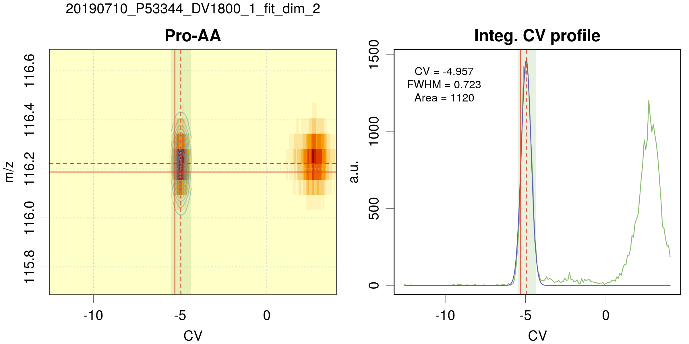

[](https://doi.org/10.5281/zenodo.3699092)

# Purpose

# Organisation 

* `analysis` contains the scripts
    + `analysis.R`
    + `checkRep.R`
    + `quantify.R`     

* `data` is the default folder for the input tables and 
   data to be analyzed

* `results` where the results are stored
    + `figs`  for figures
    + `tables` for tables

# Input files

Two input files, TASKTABLE and TGTABLE, are expected for running Analysis. Running CheckRep or Quantify requires TASKTABLE and QUANTTABLE,
Where to put your MS_files and DMS_files? Where to find your output files?
The file names are listed in TASKTABLE. TGTABLE. 

In a sake of simplicity, these folders (repositories) are defined in the “functions” script/program as:
```
# Define Data and Results repositories
dataRepo = '../data/'
figRepo  = '../results/figs/'
tabRepo  = '../results/tables/'
```

## Table of tasks: TASKTABLE 

The TASKTABLE is a “coma” (,) delimited text file. 
It can be edited using excel or Rstudio (safer). 
Note that you can insert “# “ at the beginning of a line, 
which then will be considered as a comment. TASKTABLE looks like this:

 MS_file | DMS_file | t0 | CV0 | dilu | Path
 --------|----------|----|-----|------|-----
C0_AS_DV-1800_1.d.ascii | Fichier_Dims 20190517-000000.txt | 0.08 | 6 | 0 | Esquire_MSMS_Data/2019_A_Voir/20190517_AA/

Where: 

 * `C0_AS_DV-1800_1.d.ascii` is an ASCII file, extracted using 
    DATAANALYSIS. So far, only the ESQUIRE data files extracted 
    using the `profile` option can be handled.

 * `Fichier_Dims 20190517-000000.txt` is the corresponding DMS file.
 
 * the `t0` and `CV0` values are used to convert the ESQUIRE time _t_ values into DMS _CV_ values.

* `dilu`  was initially meant to be the dilution factor of the 
  standard metabolites when spiked into a plasma (see checkRep). 
  When you perform another type of experiment, you can use  
  `dilu` as an index to specify, for example, the flow-rate of 
  the modifier, the day of the experiment, the set of samples...
  
 * `Path` allows you to organize your data within the `../data/` 
 folder. Note that the DMS_files must be in the `../data` directory. 
 In the present case, only the MS_files are expected to be found in 
 the following directory: `../data/Esquire_MSMS_Data/2019_A_Voir/20190517_AA/`.

__Important__: the date (here _20190517_) from the DMS_file and part 
of the name (here `C0_AS_DV-1800_1`) are combined to tag the output 
files as `20190517_ C0_AS_DV-1800_1.results`, for example. 
You will also find this _tag_ in the output figures.

## Table of targets : TGTABLE
The TGTABLE  is a “semicolon” (;) __ TO BE MATCHED WITH TASKTABLE !!!__ delimited text file. 
It can be edited using excel or Rstudio (safer). 
Note that you can insert “# “ at the beginning of a line, as in the example below. 
This line will be considered as a comment, which means that, 
in the present case, Glycine will not be analyzed. 

TGTABLE looks like this:

Name|m/z_EExact|m/z_exact|CV_ref
----|----------|---------|------
# Gly-AA|C2H5NO2H|76|-10.7
Ala-AA|90.054955|90.1|-7.6

Where: 

* `Name` is the given name of a metabolite,

* `m/z_EExact` is presently not used

* `m/z_exact` can actually be an approximate _m/z_ value

* `CV_ref` is the expected _CV_ value (can be omitted)


# Analysis (last version from 2020, July 16)

##Purpose

For each DMS-MS/MS experiment as given in a series in the TASKTABLE file, 
a series of metabolites given in TGTABLE is analyzed. 
Ultimately, the aim of the analysis is to integrate the peak 
(_i.e._, to derive the area) corresponding to each metabolite.

From the two dimensional data (_m/z_, _CV_), the area can be extracted 
using a 2D_fit where the fit function is the product of two Gaussian-type
functions, one in the _m/z_, the other in the _CV_ dimension. 

It turns out that we need three types of fit:

* 2D_fit in the (_m/z_, _CV_) space

* 1D_fit in the (_CV_) space, assuming that the _m/z_ value is the _m/z_exact_ given in TGTABLE __(not exactly: the nearest peak position is used)__

* 1D_fit in the _m/z_ space, assuming that the _CV_ value is the `CV_ref` 
given in the TGTABLE

The choice of fit type is set using the `fit_dim` variable. 

More generally, the important user configuration parameters are listed 
within the first line of the `analysis` script as follow:

```
# User configuration params ####
taskTable = 'files_quantification_2019.csv'
tgTable   = 'targets_paper.csv'

filter_results = TRUE
fwhm_mz_min = 0.1
fwhm_mz_max = 0.5
fwhm_cv_min = 0.5
fwhm_cv_max = 1.5
area_min    = 10

save_figures = TRUE
plot_maps    = FALSE

fit_dim  = 0    # 2: fit 2D peaks; 1: fit 1D CV line; 0: fit 1D m/z line
fallback = TRUE # Fallback on fit_dim=1 fit if 2D fit fails

weighted_fit  = FALSE
refine_CV0    = TRUE
const_fwhm    = ifelse(fit_dim == 0,NA,0.7)

dmz = 1.0       # Width of mz window around
                # exact mz for signal averaging
dCV = 1.2       # Width of CV window around
                # reference CV for peak fit
```

The general formulae of a Gaussian function is

$$G(x;a,x_0,\sigma)=\frac{a}{\sqrt{2\pi}\sigma} 
  \exp\left(-\frac{1}{2}\left(\frac{x-x_0}{\sigma}\right)^2\right)$$
                      
where a is the area, $x_0$ is the position of the peak, 
and $\sigma$ is related to the full width at maximum ($fwhm$) by 
$fwhm = 2\sqrt{2\log(2)} \sigma$. Upon the fit process of the data, 
the area is optimized, as well as peak width ($x_0$ and  $\sigma$). 
In order to control the fit, limit ranges are defined 
(`fwhm_mz_min`, … `area_min`). 
When optimizing $CV$ or $m/z$ position of the Gaussian functions, 
the window range can be specified using `dCV` and `dmz`. 

The fit dimension and type is specified using the fit_dim variable:

* `fit_dim = 2`: a two_dimensional fit is performed

* `fit_dim = 1`: a 1D fit in the _CV_ dimension is performed.   
  If `fallback=TRUE`, and if the 2D fit fails (does not converge), 
  a 1D fit with `fit_dim=1` is performed

* `fit_dim = 0`:  initially named “fast”, this is also a 1D fit in the 
  _m/z_ dimension at fixed `CV_ref`.

The `save_figures` and `plot_maps` logical variables can be used to 
save diskspace and time, respectively.

## Outputs

The output files can be found in the following repositories:

```
figRepo  = '../results/figs/'
tabRepo  = '../results/tables/'
```
### Figures 

For each experiment and target, you get a figure (on the screen and as a file) which looks like:
For a 2D fit: 


For a 1D fit (m/z), i.e. “fast”: 


### Tables 

For each experiments associated with (MS_file, DMS_file), three '.csv' 
files are generated. If your data are (MS_file= C0_AS_DV-1800_1.d.ascii,
DMS_file= Fichier_Dims 20190517-000000.txt), and if dimfit_dim=2, you get:

The results file, you will get the following columns. The first 4 columns are copies of the TGTABLE data:

Name|m/z_EExact|m/z_exact|CV_ref
----|----------|---------|------

The next 8 correspond to the position, width and corresponding dispersion values of the optimized Gaussian in the m/z and CV dimensions. 

m/z|u_m/z|CV|u_CV|FWHM_m/z|u_FWHM_m/z|FWHM_CV|u_FWHM_CV
---|-----|--|----|--------|----------|-------|---------

The next two columns are the results for the optimized Area values, and corresponding dispersion values.

Area|u_Area
----|------

Finally, you will find the `fit_dim` value, the `dilu` index, and the `tag` 
which is a concatenation of date + MS_filename + fit_dim.
