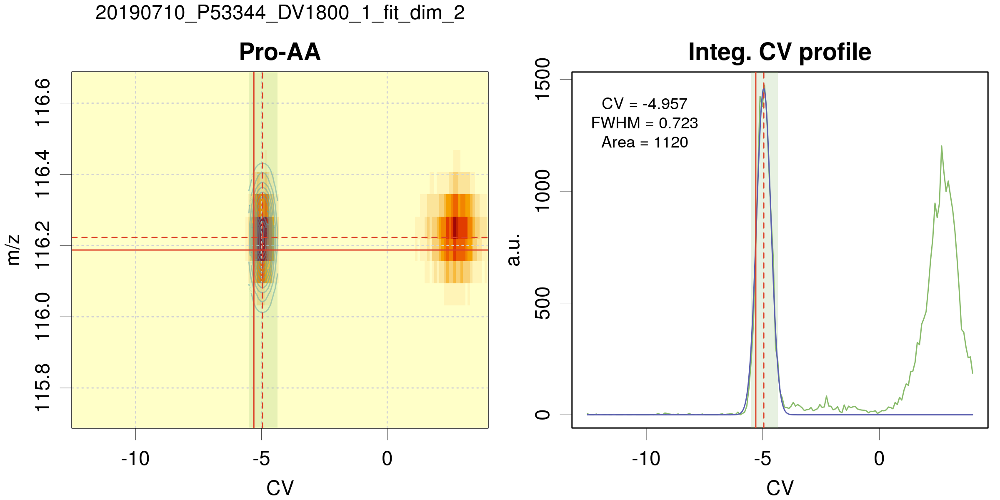
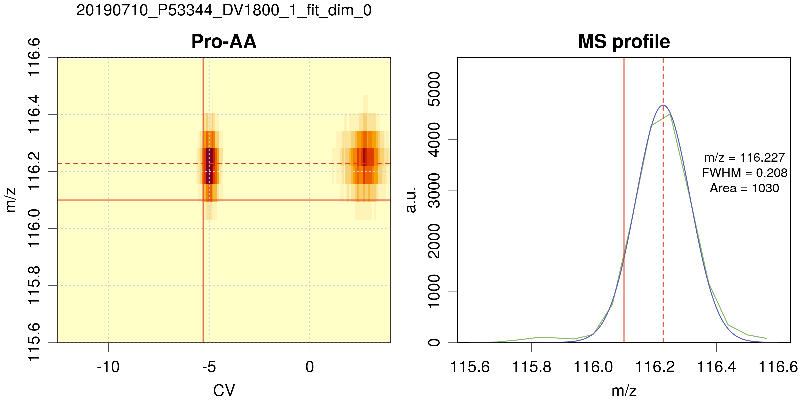

# `analysis.R` script

For each DMS-MS/MS experiment as given in a series in the `taskTable`
file, the series of metabolites given in `tgTable` is analyzed. The aim
of the analysis is to integrate the peak (*i.e.*, to estimate the area)
corresponding to each metabolite.

### Peak model

In the present version, a Gaussian peak shape is used. The formula of a
Gaussian function is \[
G(x;a,x\_0,\\sigma)=\\frac{a}{\\sqrt{2\\pi}\\sigma}
\\exp\\left(-\\frac{1}{2}\\left(\\frac{x-x\_0}{\\sigma}\\right)^2\\right)\]
where  is the area,
 is the position
of the peak, and

is related to the full width at maximum
() by
} \\sigma").
Upon the fit process of the data, the area
() is optimized, as well
as the peak’s position and width
( and
).

From the two dimensional data (*m/z*, *CV*), the area can be extracted
using a 2D fit where the fit function is the product of two Gaussian
functions, one in the *m/z*, the other in the *CV* dimension.

It turns out that we need three types of fit:

-   2D fit in the (*m/z*, *CV*) space

-   1D fit in the (*CV*) space, assuming that the *m/z* value is near
    the `m/z_ref` as given in `tgTable`

-   1D fit in the *m/z* space, assuming that the *CV* value is the
    `CV_ref` given in the `tgTable`

### Fit algorithm

We use a non-linear (weighted) least-squares algorithm to estimate the
parameters of the model: the `nls` function of the `stats` package [1].

The parameters are constrained to intervals defined by control variables
defined below. For the 2D fits, we implemented a ‘fallback’ strategy to
1D fit in the *CV* space, in cases where the 2D optimization does not
converge. The effective dimension of the fit is reported in the results
tables.

### Control variables

The choice of fit type is set using the `fit_dim` variable. The
important user configuration parameters are listed within the first line
of the `analysis.R` script as follows:

    #----------------------------------------------------------
    # User configuration params -------------------------------
    #----------------------------------------------------------

    ms_type   = c('esquire','fticr')[2]

    taskTable = 'Test2/files_quantification_2018AA.csv'
    tgTable   = 'Test2/targets_paper_renew.csv'

    fit_dim  = 1    

    filter_results = TRUE
    area_min       = 10

    userTag = paste0('fit_dim_',fit_dim)

    save_figures = TRUE
    plot_maps    = FALSE

where:

-   `ms_type`: (string) MS type (‘esquire’ or ‘fticr’)

-   `taskTable`: (string) file path to the tasks table

-   `tgTable`: (string) file path to the targets table

-   `fit_dim`: (integer) fit dimension and type:

    -   `fit_dim = 2`: a two\_dimensional (*m/z*,*CV*) fit is performed

    -   `fit_dim = 1`: a 1D fit in the *CV* dimension is performed.

    -   `fit_dim = 0`: a 1D fit, but in the *m/z* dimension at fixed
        `CV_ref` (initially named “fast”).

-   `filter_results`: (logical) filter the recovered peak widths and
    areas. The filtering rejects fwhm values outside of

    -   \[`fwhm_mz_min`,`fwhm_mz_max`\] in the *m/z* dimension

    -   \[`fwhm_cv_min`,`fwhm_cv_max`\] in the *CV* dimension

    and areas smaller than `area_min`. The `fwhm_xxx` parameters depend
    on `ms_type` and they are defined in the `getPeakSpecs()` function.

-   `userTag`: (string) a tag that will be added to the names of the
    results files. Default uses fit-dim.

-   `save_figures`: (logical) save the plots on disk

-   `plot_maps`: (logical) generate 2D maps summarizing the position of
    fitted targets for a given task

A set of technical parameters, affecting various aspects of the peaks
fit are also available. However, their default values should not be
changed without caution.

    #----------------------------------------------------------
    # Technical params (change only if you know why...) -------
    #----------------------------------------------------------

    fallback        = TRUE   
    correct_overlap = FALSE  
    weighted_fit    = FALSE
    refine_CV0      = TRUE
    debug           = FALSE  

-   `fallback`: (logical) use `fit_dim=1` in cases where `fit_dim=2`
    fails (optimizer does not converge).

-   `correct_overlap`: (logical) provision for a correction of peaks
    overlap (experimental).

-   `weighted_fit`: (logical) apply a Poisson-type weighting to the
    fitted data

-   `refine_CV0`: (logical) refine the center of the search window for
    the *CV* position of the peak. If `FALSE`, use the value defined in
    `tgTable`.

-   `debug`: (logical) stop the analysis after the first target.

### Outputs

The output files can be found in the following repositories:

    figRepo  = '../results/figs/'
    tabRepo  = '../results/tables/'

All output files are prefixed with a string built by concatenation of
the DMS file date, MS file root and fit\_dim value. For instance, if
your data are (MS\_file = ‘C0\_AS\_DV-1800\_1.d.ascii’, DMS\_file =
‘Fichier\_Dims 20190517-000000.txt’), and if `fit_dim=2`,  
one has `prefix = 20190517_C0_AS_DV-1800_1_fit_dim_2_`.

#### Figures

For each task and target, a figure is generated (on screen and as a file
if `save_figures=TRUE`), showing the 2D location of the peak and its
profile, either in the *CV* dimension (`fit-dim =1,2`), or in the *m/z*
dimension (`fit_dim=0`). The name of the file is built from the task
prefix and the target name.

**Example of a 2D fit** 

-   On the left panel, the 2D map centered on the peak position. The
    data are coded in color intensity from pale yellow to red. The pale
    blue-green area is the *CV* search range for the peak position. The
    solid red lines depict the peak position defined by `m/z_ref` and
    `CV_ref` in the targets table. The dashed red lines correspond to
    the estimated peak position. If the 2D fit is successful, green
    contour lines of the peak are displayed.

-   On the right panel, the *CV* peak profile for data integrated over
    *m/z* (green curve). The blue line is the best fit. The red lines
    and pale blue have the same meaning as above. The best-fit
    parameters are reported in the graph, with a warning in case of fit
    problems.

**Example of a 1D fit along *m/z* (`fit_dim=0`)** 

-   Same legend as for the 2D fit, except for the right panel, which
    represents the *m/z* profile of the peak.

#### Tables

For each experiments/task associated with (MS\_file, DMS\_file), three
comma delimited ‘.csv’ files are generated: `prefix_results.csv`,
`prefix_fit.csv` and `prefix_XIC.csv`.

For each task, a file names `prefix_ctrlParams.yaml` is also generated
for reproducibility purpose. It contains the values of all the control
variables for this task.

**Notes**

-   In output files, the missing data are represented by `NA`s.

##### Fit results: `XXX_results.csv`

-   the first 4 columns are copies of the `tgTable` data:

    | Name | Comments | m/z\_ref | CV\_ref |
    |------|----------|----------|---------|

-   the next 8 columns correspond to the position, width and uncertainty
    values of the optimized Gaussian in the m/z and CV dimensions
    (unavailable data are represented by `NA`)

    | m/z | u\_m/z | CV  | u\_CV | FWHM\_m/z | u\_FWHM\_m/z | FWHM\_CV | u\_FWHM\_CV |
    |-----|--------|-----|-------|-----------|--------------|----------|-------------|

-   the next 2 columns are the results for the optimized Area values,
    and corresponding uncertainty.

    | Area | u\_Area |
    |------|---------|

-   finally, you will find the `fit_dim` value, the `dilu` index, and
    the `tag` which is a concatenation of date + MS\_filename + fit\_dim
    that can be used for further sorting of the results.

    | fit\_dim | dilu | tag |
    |----------|------|-----|

##### Peak profiles: `XXX_fit.csv` and `XXX_XIC.csv`

The `XXX_XIC.csv` file contains the *time*/*CV* data profiles integrated
over *m/z* for the compounds in `tgTable` (`fit_dim=1,2`) or the *m/z*
data profile (`fit_dim=0`) for the species in `tgTable`. The
`XXX_fit.csv` file contains the corresponding gaussian peak profiles.

-   For `fit_dim=1,2`, the first two columns are the *time* and *CV*
    abscissae of the profiles

    | time | CV  |
    |------|-----|

    For `fit_dim=0`, the first column is *m/z*

    | m/z |
    |-----|

-   the following columns are headed by the name of the compound and
    contain the corresponding profiles
