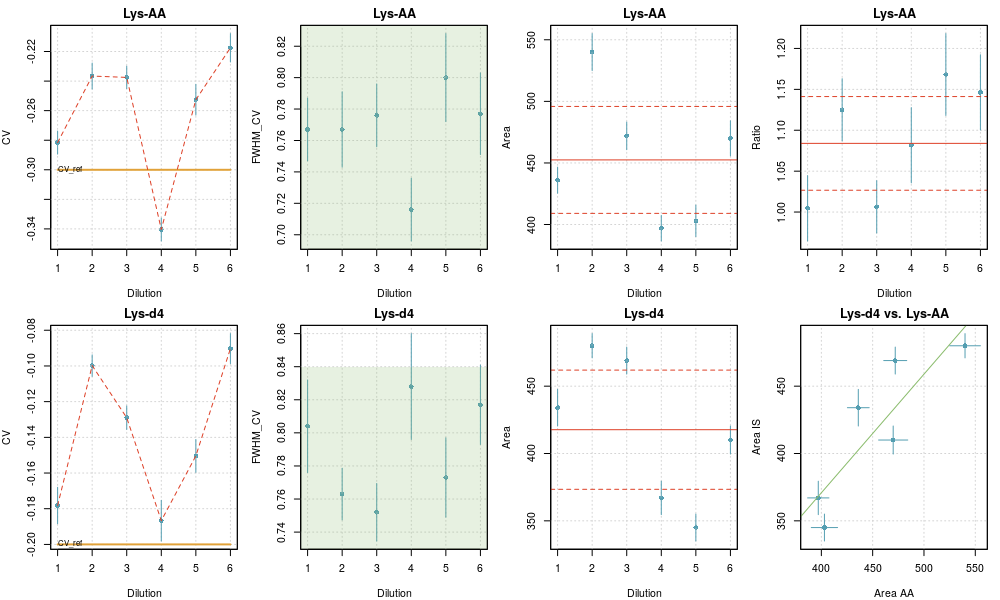
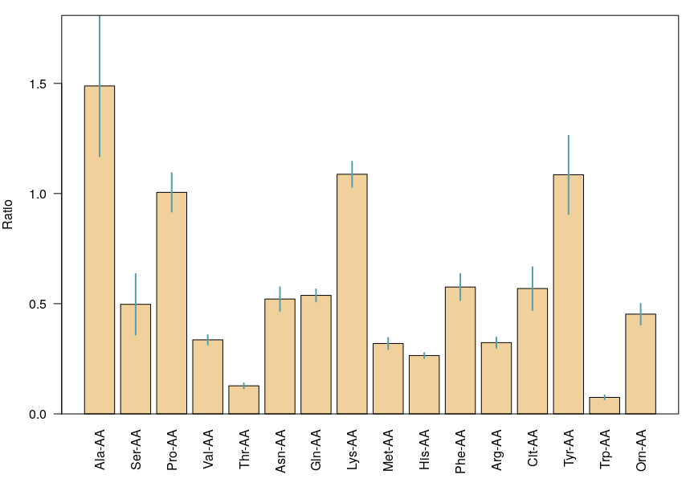

# `checkRep.R` script

This script collects the set of results files generated by `analysis.R`
as specified in the `taskTable` and generates figures and statistics.
The peak parameters are plotted as a function of `dilu`. If `dilu`
contains the experiment index, `checkRep.R` can be used to assess the
repeatability of an analysis.

## Control variables

The job is defined by a few parameters.

    taskTable  = 'files_quantification_2019July10.csv'
    quantTable = 'targets_paper_quantification.csv'

    fit_dim = 2
    userTag = paste0('fit_dim_',fit_dim)

    const_fwhm = 0.7
    area_min   = 10

    makePlots = TRUE

-   `taskTable`: (string) file path to the list of experiments to be
    compared

-   `quantTable`: (string) list of the compounds for which the
    comparisons should be done

-   `fit_dim`: (integer) type of peak fit for which the comparisons
    should be done

-   `userTag`: (string) tag to differentiate the outputs. In the present
    case, one wants to compare the repeatability for different peak fit
    approaches.

-   `const_fwhm`: (numerical) estimate of the peak width in the *CV*
    direction to define the plot axes.

-   `area_min` (numerical) should have the same value than used in
    `analysis.R` (only used for reporting in plots)

-   `makePlots`: (logical) generate the plots, or not…

## Outputs

### Figures

Figures summarizing the set of data for all pairs of species and a
summary of the mean values and their uncertainty are generated.

Presently, the plots are generated in the Rstudio interface, but not
saved to disk.

**Checkrep plot for a repeatability analysis** 

-   The plot reports the fit data (CV, FWHM and Area) for the species
    (top row) and its tracer (bottom row). The last column displays the
    calculated area ratios (top) and the correlation plot of the areas
    for both species (bottom).

    -   For FWHM, the green area depicts the limits imposed in the fit.

    -   For Area and Ratio, the weighted mean and the limits of a
        two-sigma uncertainty interval are represented as red horizontal
        lines, full and dashed respectively.

    -   For the Areas correlation plot, the unit line is represented in
        green.

-   For each point, two-sigma error bars are printed in blue.

**Mean values and uncertainties for a repeatability analysis**

### Tables

The name of the file is a concatenation of the date, time, `userTag`,
and ‘\_compilation.csv’. It contains all the collected results, with the
following additions:

-   two columns containing the ratio of areas for pairs of compounds
    defined in `quantTable`, and its uncertainty

    | ratio | u\_ratio |
    |-------|----------|
    |       |          |

-   a set of lines with tag “Mean”, containing for each target compound
    the mean of the properties over the set of experiments. Weighted
    means are used, with weights estimated by the Cochran’s ANOVA method [1].

    The observed variance is decomposed in two terms: the variance due
    to the parametric uncertainty on the property (estimated in
    `analysis.R`), and an unknown variance term due to experimental
    fluctuations (repeatability). The latter is estimated as the
    observed variance minus the mean of the parametric variances, with a
    positivity constraint. The variance for a datum is then the sum of
    its parametric variance and the repeatability variance. The weights
    are the normalized reciprocal variances [2].

## References

[1] C. Rivier *et al.* (2014) *Accredit. Qual. Assur.* **19**:269–274
[doi](doi:https://doi.org/10.1007/s00769-014-1066-3)

[2] Inverse variance weighting in
[Wikipedia](https://en.wikipedia.org/wiki/Inverse-variance_weighting)
